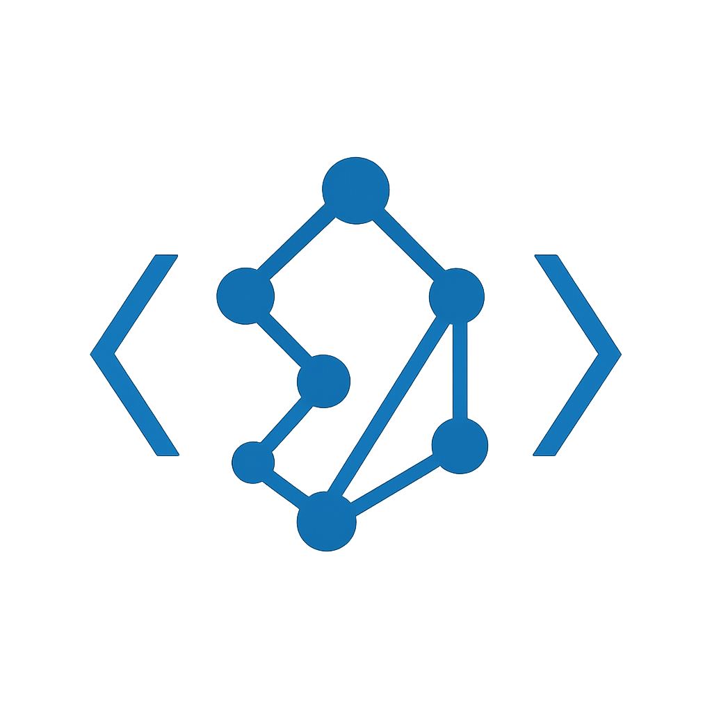

<div align="center">



# Mesh: Python Agent Graph Orchestration Engine

**Build agent and multi-agent workflows as executable graphs**

[](https://opensource.org/licenses/MIT)
[](https://www.python.org/downloads/)

</div>

---

**Mesh** is a lightweight Python library for orchestrating multi-agent workflows as executable graphs. Build complex agent systems with token-by-token streaming, state management, and seamless integration with Vel and OpenAI Agents SDK.

## Documentation

📚 **[View Full Documentation →](https://rscheiwe.github.io/mesh)**

Comprehensive guides and API reference:

- **[Getting Started](https://rscheiwe.github.io/mesh/getting-started)** - Installation and configuration
- **[Quick Start](https://rscheiwe.github.io/mesh/quick-start)** - Build your first graph in 5 minutes
- **[Core Concepts](https://rscheiwe.github.io/mesh/concepts/graphs)** - Graphs, nodes, execution, events
- **[Guides](https://rscheiwe.github.io/mesh/guides/streaming)** - Streaming, loops, state management, variables
- **[Integrations](https://rscheiwe.github.io/mesh/integrations/vel)** - Vel, OpenAI Agents SDK
- **[API Reference](https://rscheiwe.github.io/mesh/api-reference)** - Complete API documentation
- **[Examples](https://rscheiwe.github.io/mesh/examples)** - Working code examples

## Features

- **Graph-Based Workflows**: Build agent workflows as directed graphs with controlled cycles
- **Dual API**: Programmatic (LangGraph-style) and declarative (React Flow JSON) interfaces
- **Graph Visualization**: Generate Mermaid diagrams with color-coded node types
- **Token-by-Token Streaming**: Real-time streaming with provider-agnostic events
- **Event Translation**: Use Vel's standardized events or provider-native events
- **Multiple Agent Frameworks**: Auto-detection for Vel and OpenAI Agents SDK
- **Multi-Provider Support**: OpenAI, Anthropic, Google via Vel translation
- **7 Core Node Types**: Start, End, Agent, LLM, Tool, Condition, Loop
- **State Persistence**: Pluggable backends (SQLite, in-memory, custom)
- **Variable Resolution**: Template variables for dynamic workflows
- **Production Ready**: Error handling, retries, and structured logging

## Installation

```bash
# Basic installation
pip install mesh

# With Vel SDK support
pip install mesh[vel]

# With OpenAI Agents SDK support
pip install mesh[agents]

# With FastAPI server support
pip install mesh[server]

# Development installation
pip install mesh[dev]

# All features
pip install mesh[all]
```

## Configuration

Create a `.env` file in your project root:

```bash
cp .env.example .env
```

Add your OpenAI API key:

```bash
OPENAI_API_KEY=sk-your-key-here
```

Load it in your code:

```python
from mesh.utils import load_env
load_env()  # Loads variables from .env
```

## Quick Start

### Programmatic API (LangGraph-style)

```python
import asyncio
from mesh import StateGraph, Executor, ExecutionContext, MemoryBackend
from mesh.nodes import LLMNode

async def main():
    # Build graph
    graph = StateGraph()
    graph.add_node("llm", None, node_type="llm", model="gpt-4")
    graph.add_edge("START", "llm")
    graph.set_entry_point("llm")

    # Compile and execute
    compiled = graph.compile()
    executor = Executor(compiled, MemoryBackend())
    context = ExecutionContext(
        graph_id="my-graph",
        session_id="session-1",
        chat_history=[],
        variables={},
        state={}
    )

    # Stream results
    async for event in executor.execute("What is 2+2?", context):
        if event.type == "token":
            print(event.content, end="", flush=True)

asyncio.run(main())
```

### React Flow JSON (Flowise-compatible)

```python
from mesh import ReactFlowParser, NodeRegistry, Executor

# Parse Flowise JSON
registry = NodeRegistry()
parser = ReactFlowParser(registry)
graph = parser.parse(flow_json)

# Execute
executor = Executor(graph, backend)
async for event in executor.execute(input_data, context):
    print(event)
```

### FastAPI Server

```python
from fastapi import FastAPI
from mesh import Executor, ExecutionContext
from mesh.streaming import SSEAdapter

app = FastAPI()

@app.post("/execute/stream")
async def execute_stream(request: ExecuteRequest):
    executor = Executor(graph, backend)
    context = ExecutionContext(...)

    adapter = SSEAdapter()
    return adapter.to_streaming_response(
        executor.execute(request.input, context)
    )
```

## Core Concepts

### Node Types

1. **StartNode**: Entry point to the graph
2. **EndNode**: Exit point from the graph
3. **AgentNode**: Wraps Vel or OpenAI agents with auto-detection
4. **LLMNode**: Direct LLM calls with streaming
5. **ToolNode**: Execute Python functions
6. **ConditionNode**: Conditional branching
7. **LoopNode**: Iterate over arrays

### Variable Resolution

Mesh supports template variables in node configurations:

- `{{$question}}` - User input
- `{{node_id}}` - Reference node output
- `{{node_id.field}}` - Access nested fields
- `{{$vars.key}}` - Global variables
- `{{$chat_history}}` - Formatted chat history
- `{{$iteration}}` - Current iteration value (in loops)

### State Management

```python
# In-memory (for development)
from mesh.backends import MemoryBackend
backend = MemoryBackend()

# SQLite (for production)
from mesh.backends import SQLiteBackend
backend = SQLiteBackend("mesh_state.db")
```

## Advanced Usage

### Conditional Branching

```python
from mesh.nodes import Condition

def check_success(output):
    return "success" in str(output).lower()

graph.add_node("condition", [
    Condition("success", check_success, "success_handler"),
    Condition("failure", lambda x: not check_success(x), "error_handler"),
], node_type="condition")
```

### Loop Processing

```python
graph.add_node("loop", None, node_type="loop",
               array_path="$.items", max_iterations=100)
```

### Custom Tools

```python
def my_tool(input: str, multiplier: int = 2) -> str:
    return input * multiplier

graph.add_node("tool", my_tool, node_type="tool",
               config={"bindings": {"multiplier": 3}})
```

### Agent Integration

```python
# Vel Agent (with streaming)
from vel import Agent as VelAgent
vel_agent = VelAgent(
    id="assistant",
    model={
        "provider": "openai",
        "name": "gpt-4",
        "temperature": 0.7,
    },
)
graph.add_node("agent", vel_agent, node_type="agent")

# Stream the output
async for event in executor.execute("Hello!", context):
    if event.type == "token":
        print(event.content, end="", flush=True)

# OpenAI Agents SDK (with Vel translation by default)
from agents import Agent
openai_agent = Agent(
    name="Assistant",
    instructions="You are a helpful assistant"
)
graph.add_node("agent", openai_agent, node_type="agent", config={"model": "gpt-4"})

# Or use native events
graph.add_node("agent", openai_agent, node_type="agent",
               use_native_events=True, config={"model": "gpt-4"})
```

### Event Translation

By default, Mesh uses Vel's event translation for consistent event handling across providers:

```python
# Default: Vel-translated events (consistent across providers)
graph.add_node("agent", agent, node_type="agent")

# All providers emit the same event types
async for event in executor.execute(input, context):
    if event.type == "token":  # Same for OpenAI, Anthropic, Google
        print(event.content, end="", flush=True)

# Optional: Use provider's native events
graph.add_node("agent", agent, node_type="agent", use_native_events=True)
```

See [Event Translation Guide](examples/EVENT_TRANSLATION.md) for details.

## Architecture

```
┌─────────────────────────────────────────────┐
│           User Application                  │
│       (FastAPI/Flask/Django)                │
└────────────────┬────────────────────────────┘
                 │
                 ▼
┌─────────────────────────────────────────────┐
│            MESH LIBRARY                     │
├─────────────────────────────────────────────┤
│  ┌──────────────┐    ┌──────────────┐      │
│  │  Parsers     │    │  Builders    │      │
│  │  - ReactFlow │    │  - StateGraph│      │
│  └──────┬───────┘    └──────┬───────┘      │
│         └──────────┬─────────┘              │
│                    ▼                         │
│         ┌──────────────────┐                │
│         │  Graph Compiler  │                │
│         └────────┬─────────┘                │
│                  ▼                           │
│         ┌──────────────────┐                │
│         │ Execution Engine │                │
│         │  - Queue-based   │                │
│         │  - Streaming     │                │
│         └────────┬─────────┘                │
│                  ▼                           │
│      ┌───────────────────────┐              │
│      │   Node Implementations│              │
│      │  Agent│LLM│Tool│...   │              │
│      └───────────────────────┘              │
└─────────────────────────────────────────────┘
```

## Examples

See the **[examples/](examples/)** directory:

- **[simple_agent.py](examples/simple_agent.py)** - Basic LLM usage with streaming
- **[vel_agent_streaming.py](examples/vel_agent_streaming.py)** - Vel agent with token-by-token streaming
- **[openai_agent_streaming.py](examples/openai_agent_streaming.py)** - OpenAI Agents SDK with streaming
- **[event_translation_comparison.py](examples/event_translation_comparison.py)** - Compare Vel vs native events
- **[react_flow_parse.py](examples/react_flow_parse.py)** - Parse Flowise JSON
- **[fastapi_server.py](examples/fastapi_server.py)** - Full API server with streaming

**Guides:**

- **[Event Translation Guide](examples/EVENT_TRANSLATION.md)** - Detailed event translation documentation
- **[Vel Integration Guide](examples/VEL_INTEGRATION.md)** - Vel-specific integration
- **[OpenAI Agents Integration](examples/OPENAI_AGENTS_INTEGRATION.md)** - OpenAI SDK integration
- **[Native Events Implementation](NATIVE_EVENTS_IMPLEMENTATION.md)** - use_native_events flag details

## Development

```bash
# Clone repository
git clone https://github.com/rscheiwe/mesh.git
cd mesh

# Create virtual environment
python -m venv venv
source venv/bin/activate  # On Windows: venv\Scripts\activate

# Install development dependencies
pip install -e ".[all]"

# Run tests
pytest

# Run tests with coverage
pytest --cov=mesh --cov-report=html

# Format code
black mesh/
ruff check mesh/

# Type checking
mypy mesh/
```

**For AI Assistants:** See [CLAUDE.md](CLAUDE.md) for comprehensive development context and architecture details.

## Roadmap

- [ ] WebSocket streaming support
- [ ] Distributed execution
- [ ] Visual graph editor
- [ ] LangChain/LlamaIndex integration
- [ ] Human-in-the-loop approval nodes
- [ ] Sub-graph composition

## Contributing

Contributions welcome! Please read our contributing guidelines and submit PRs.

## License

MIT License - see LICENSE file for details.

## Credits

Inspired by:

- [Flowise](https://github.com/FlowiseAI/Flowise) - React Flow execution patterns
- [LangGraph](https://github.com/langchain-ai/langgraph) - StateGraph API design
- [Vel](https://github.com/rscheiwe/vel) - Event translation layer

## Support

- **Documentation:** https://rscheiwe.github.io/mesh
- **GitHub Issues:** https://github.com/rscheiwe/mesh/issues
- **GitHub Repository:** https://github.com/rscheiwe/mesh
