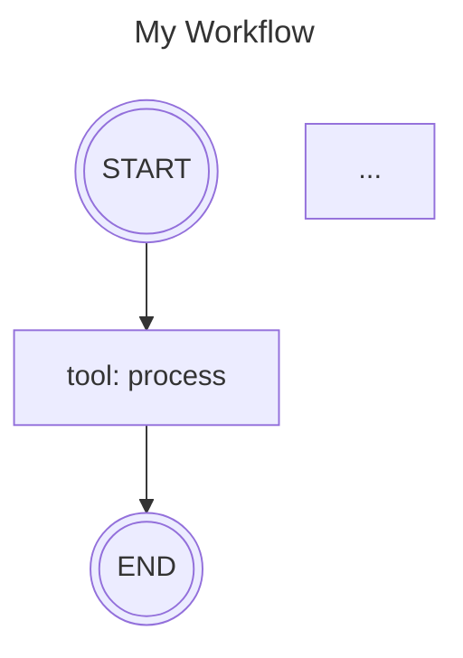

# Graph Visualization
{: .no_toc }

Visualize your Mesh graphs as beautiful Mermaid diagrams with automatic color-coding and clear flow representation.

{: .note }
> **Inspired by [Pydantic Graph](https://ai.pydantic.dev/graph/)**
> The visualization API design and mermaid.ink integration approach is inspired by Pydantic AI's excellent graph visualization implementation. We've adapted the concept to fit Mesh's unique node types and workflow patterns.

## Table of Contents
{: .no_toc .text-delta }

1. TOC
{:toc}

---

## Overview

Mesh provides built-in visualization capabilities that generate Mermaid flowchart diagrams from your graphs. These visualizations:

- **Automatically color-code** different node types for easy identification
- **Show loop edges** with iteration limits
- **Display termination points** for cyclic graphs
- **Support multiple output formats**: PNG, SVG, PDF
- **Use mermaid.ink API** for image generation

## Quick Start

Generate a visualization in two simple steps:

```python
from mesh import StateGraph

# Build your graph
graph = StateGraph()
graph.add_node("process", my_function, node_type="tool")
graph.add_edge("process", "END")
graph.set_entry_point("process")

# Save visualization
output_path = graph.save_visualization(
    title="My Graph",
    format="png"
)
print(f"Saved to: {output_path}")
```

## Node Type Colors

Each node type is automatically styled with a distinct color:

| Node Type | Color | Shape | Purpose |
|-----------|-------|-------|---------|
| **START** | Dark Gray | Filled Circle | Entry point |
| **END** | Red | Circle | Termination point |
| **Agent** | Red | Rounded Rectangle | Intelligent agent processing |
| **LLM** | Blue | Rounded Rectangle | Direct LLM calls |
| **Tool** | Green | Rounded Rectangle | Utility functions |
| **Condition** | Yellow | Diamond | Decision/routing points |
| **Loop** | Purple | Rounded Rectangle | Iteration nodes |

This color-coding makes it easy to understand the role of each component at a glance.

## Basic Usage

### Generate Mermaid Code

Get the raw Mermaid flowchart code for your graph:

```python
graph = StateGraph()
# ... build your graph

# Generate Mermaid code
mermaid_code = graph.mermaid_code(
    title="My Workflow",
    direction="TD"  # Top-Down or "LR" for Left-Right
)

print(mermaid_code)
```

**Output:**


### Save as Image

Save the visualization as a PNG, SVG, or PDF:

```python
# Save with auto-generated filename
path = graph.save_visualization(
    title="my_graph",
    image_format="png"  # "png", "svg", or "pdf"
)

# Save to specific path
path = graph.save_visualization(
    output_path="/path/to/my_diagram.png",
    title="Custom Graph"
)
```

**Default Location:** `mesh/visualizations/{title}_{timestamp}.{format}`

## Visualization Patterns

### Sequential Workflow

Simple linear pipeline with no branching:

```python
graph = StateGraph()

graph.add_node("step1", func1, node_type="tool")
graph.add_node("step2", func2, node_type="tool")
graph.add_node("step3", func3, node_type="tool")

graph.add_edge("step1", "step2")
graph.add_edge("step2", "step3")
graph.set_entry_point("step1")

graph.save_visualization(title="sequential_workflow")
```

**Result:** START → step1 → step2 → step3 → END

### Conditional Branching

Decision points with multiple paths:

```python
from mesh.nodes.condition import Condition

graph = StateGraph()

graph.add_node("analyzer", analyze_fn, node_type="tool")

conditions = [
    Condition("positive", lambda x: x["sentiment"] == "positive", "handler_a"),
    Condition("negative", lambda x: x["sentiment"] == "negative", "handler_b")
]
graph.add_node("router", conditions, node_type="condition")

graph.add_node("handler_a", handle_positive, node_type="tool")
graph.add_node("handler_b", handle_negative, node_type="tool")

graph.add_edge("analyzer", "router")
graph.add_edge("router", "handler_a")
graph.add_edge("router", "handler_b")

graph.set_entry_point("analyzer")
graph.save_visualization(title="conditional_branching")
```

**Result:**
- Analyzer → **Yellow Diamond** (router) → [handler_a OR handler_b] → END
- The condition node appears as a diamond shape

### Cyclic Graphs (Loops)

Graphs with controlled loops show iteration limits and termination points:

```python
graph = StateGraph()

graph.add_node("check", check_fn, node_type="tool")
graph.add_node("increment", increment_fn, node_type="tool")

graph.add_edge("check", "increment")
graph.add_edge(
    "increment",
    "check",
    is_loop_edge=True,
    max_iterations=20
)

graph.set_entry_point("check")
graph.save_visualization(title="loop_graph")
```

**Result:**
- Loop edge labeled with "max: 20"
- END node connects from `check` (the loop decision point)
- Clear visual indication of where the loop exits

### Mixed Node Types

Showcase all node type colors in one graph:

```python
graph = StateGraph()

# Tool nodes (GREEN)
graph.add_node("preprocessor", preprocess, node_type="tool")

# Condition node (YELLOW)
graph.add_node("router", conditions, node_type="condition")

# LLM node (BLUE) - requires API key or mock
graph.add_node("llm", None, node_type="llm", model="gpt-4")

# Agent node (RED) - requires agent instance
graph.add_node("agent", my_agent, node_type="agent")

# Build edges...
graph.save_visualization(title="mixed_types")
```

**Result:** Each node type displays in its designated color

## Advanced Features

### Custom Direction

Control the flow direction of your diagram:

```python
# Top-Down (default)
graph.mermaid_code(direction="TD")

# Left-Right
graph.mermaid_code(direction="LR")
```

### Multiple Format Support

Save in different formats for different use cases:

```python
# PNG for documentation
graph.save_visualization(title="docs_diagram", image_format="png")

# SVG for web/scaling
graph.save_visualization(title="web_diagram", image_format="svg")

# PDF for presentations
graph.save_visualization(title="presentation", image_format="pdf")
```

### Automatic END Node Detection

Mesh automatically adds termination points for better visualization:

1. **Cyclic Graphs**: END connects from loop decision nodes (where exit condition is evaluated)
2. **Linear Graphs**: END connects from nodes with no forward edges
3. **Branching Graphs**: END connects from all terminal branches

This ensures every visualization has a clear completion point.

## API Reference

### StateGraph.mermaid_code()

```python
def mermaid_code(
    self,
    title: Optional[str] = None,
    direction: str = "TD"
) -> str:
```

Generate Mermaid flowchart code from the graph.

**Parameters:**
- `title` (str, optional): Title displayed above the diagram
- `direction` (str): Flowchart direction - "TD" (top-down) or "LR" (left-right)

**Returns:** String containing Mermaid flowchart code

### StateGraph.save_visualization()

```python
def save_visualization(
    self,
    output_path: Optional[str] = None,
    title: Optional[str] = None,
    image_format: str = "png",
    direction: str = "TD"
) -> str:
```

Generate and save a Mermaid diagram visualization.

**Parameters:**
- `output_path` (str, optional): Path for output file. If None, auto-generates in `mesh/visualizations/`
- `title` (str, optional): Title displayed above the diagram
- `image_format` (str): Output format - "png", "svg", or "pdf"
- `direction` (str): Flowchart direction - "TD" or "LR"

**Returns:** Path to saved image file (absolute path)

**Raises:**
- `httpx.HTTPError`: If image generation via mermaid.ink fails
- `GraphValidationError`: If graph structure is invalid

## Examples

Complete working examples are available in `examples/visualization_examples/`:

1. **01_cyclic_graph.py** - Loop patterns with termination points
2. **02_sequential_workflow.py** - Linear pipeline visualization
3. **03_conditional_branching.py** - Decision points with diamond nodes
4. **04_multi_agent_workflow.py** - Multi-stage processing pipeline
5. **05_mixed_node_types.py** - **Color palette showcase** ⭐

Run any example:

```bash
python examples/visualization_examples/05_mixed_node_types.py
```

Each example:
- Prints the Mermaid code
- Saves a PNG to `mesh/visualizations/`
- Explains the graph pattern

## Troubleshooting

### "HTTPError: 404 Not Found"

**Cause:** Mermaid.ink API issue or invalid Mermaid syntax

**Solution:**
1. Check the generated Mermaid code with `graph.mermaid_code()`
2. Verify syntax at [Mermaid Live Editor](https://mermaid.live)
3. Check network connectivity to mermaid.ink

### "No module named 'httpx'"

**Cause:** Missing httpx dependency

**Solution:**
```bash
pip install httpx
```

(httpx is included in Mesh's base dependencies)

### Visualization is too wide/narrow

**Solution:** Use different direction:

```python
# Try left-right instead of top-down
graph.save_visualization(direction="LR")
```

### Colors not showing correctly

**Cause:** Mermaid.ink may not support all styling

**Solution:**
- Use PNG or SVG format (PDF has limited color support)
- Verify Mermaid code manually with `graph.mermaid_code()`

## Best Practices

### 1. Use Descriptive Titles

```python
# Good
graph.save_visualization(title="user_registration_flow")

# Avoid
graph.save_visualization(title="graph1")
```

### 2. Visualize Before Executing

Generate visualizations during development to catch structural issues:

```python
# Visualize first to verify structure
graph.save_visualization(title="dev_check")

# Then execute
compiled = graph.compile()
executor.execute(input, context)
```

### 3. Keep Graphs Reasonable Size

For graphs with 15+ nodes, consider:
- Using left-right direction: `direction="LR"`
- Breaking into sub-graphs
- Focusing visualizations on specific sections

### 4. Version Control

Add visualizations to documentation but gitignore the output directory:

```gitignore
# .gitignore
mesh/visualizations/*.png
mesh/visualizations/*.svg
mesh/visualizations/*.pdf
```

Keep only reference diagrams in docs.

### 5. Color Legend for Stakeholders

When sharing visualizations, include the color legend:

```markdown
# Graph Legend
- 🟢 GREEN: Data processing tools
- 🔵 BLUE: LLM-powered nodes
- 🔴 RED: Autonomous agents
- 🟡 YELLOW: Decision points
```

## Integration with Documentation

Use visualizations in your documentation:

```markdown
# My Workflow Documentation

## Architecture


The workflow processes data through three stages...
```

## See Also

- [Graphs](../concepts/graphs) - Understanding graph structure
- [Nodes](../concepts/nodes) - Node types and configuration
- [Loops](loops) - Creating controlled cycles
- [Examples](../examples) - More usage examples
